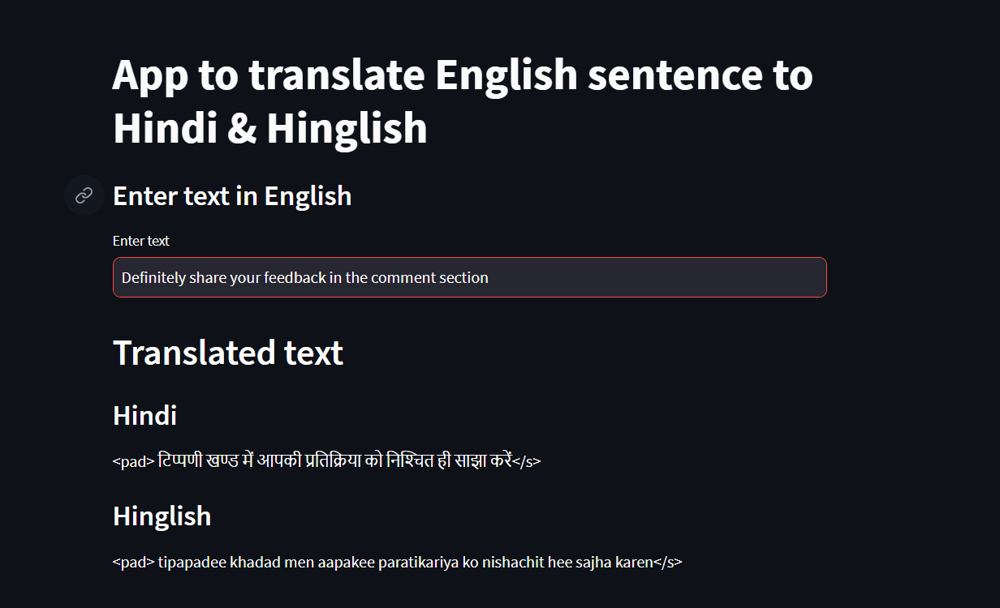

# Translation English to Hinglish 🇬🇧 -> 🇮🇳

NLP library to translate English text into Hinglish.

Hinglish is a blend of words between Hindi & English

Eg;

English: Mahatma Gandhi is the father of the nation of India

Hindi: महात्मा गांधी भारत के राष्ट्रपिता हैं

Hinglish: Mahatma Gandhi bharat ke rashtrapita hae

Built by [Abhishek Raj](https://github.com/Er-AbhishekRaj07)

##  How it works
### Model
This project uses [Helsinki-NLP/opus-mt-en-hi](https://huggingface.co/Helsinki-NLP/opus-mt-en-hi) model from Hugging Face transformers.

### Inference
Above mentioned model is trained in translating English text to Hindi. Additional code has been added to convert Hindi text to Hinglish. As a summation, the library can convert any English text to Hinglish

## How to run
- Download the repository
- Run the following command
```py
streamlit run streamlit-translator-english-to-hinglish.py
```

## Libraries used
- Pytorch
- Huggingface Transformers
- Streamlit
## Contact
If you have any questions or feedback, feel free to reach out to me at <Abhishekgeu03@gmail.com>

## Screenshots

[]([task 1.png](https://github.com/Er-AbhishekRaj07/Translation-Assignment/blob/main/task%201.png))
- Add a brief description of the screenshot.

[](link_to_screenshot_2)
- Add a brief description of the screenshot.

[...]
